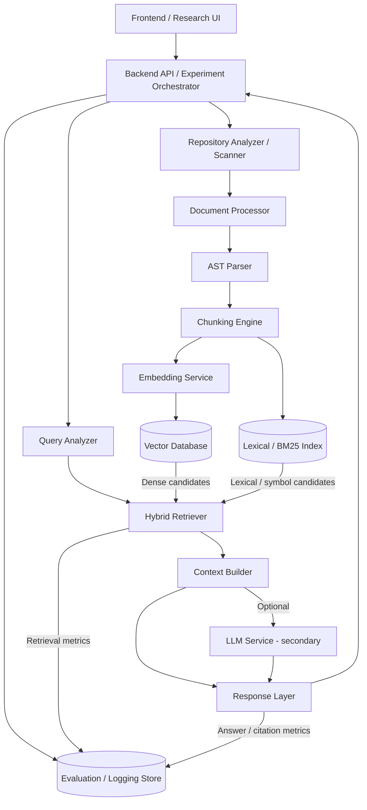

# Component Architecture Diagram

**Status:** Phase 1 blueprint — no implementation exists yet.

## Notes

- Each component behind the Backend API is intended to be independently testable and swappable (per the maintainability non-functional requirement).
- The Hybrid Retriever supports three selectable strategies: BM25-only, dense-only, and combined hybrid — all three must be comparable for the primary research evaluation.
- The LLM Service is explicitly marked secondary/optional to keep the primary retrieval study decoupled from generation quality.
