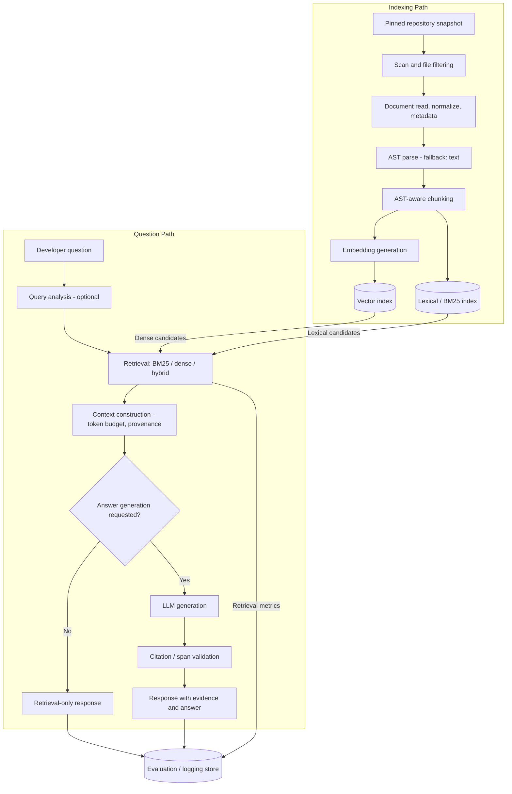

# Data Flow Diagram

**Status:** Phase 1 blueprint — no implementation exists yet.

## Notes

- The indexing path and question path are independent; the question path only depends on the indexes produced by indexing, not on a live indexing run.
- Every response (retrieval-only or generated) is logged with metrics inputs to support the Recall@k / MRR / nDCG and citation-validity evaluation defined in the requirements.
