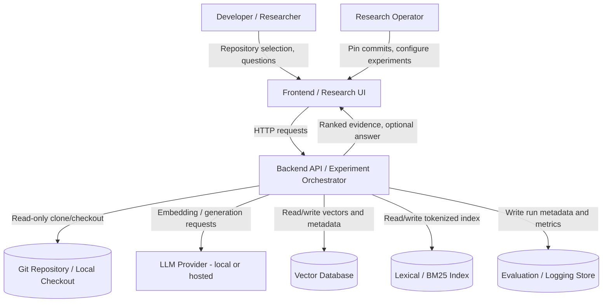

# System Context Diagram

**Status:** Phase 1 blueprint — no implementation exists yet.

## Notes

- The system never writes into the indexed source repository.
- The LLM Provider is only invoked when answer-generation mode is explicitly requested; retrieval-only mode does not call it.
- The Research Operator and Developer/Researcher may be the same person for a solo thesis project, but the roles are distinguished by responsibility (experiment configuration vs. question asking).
