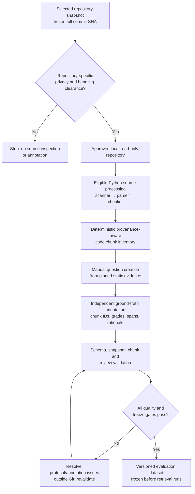

# Phase 19.8 - Supersession notice

**SUPERSEDED — replaced by lightweight thesis workflow**

Effective 2026-09-27. Use the [lightweight thesis workflow](thesis-benchmark-workflow.md) as the current operational reference. The original document below is preserved as historical evidence, including its prior decisions, unresolved findings and phase-specific statuses. Its approval chains, mandatory forms/signatures/reviewer assignments, expansion quotas and unused-candidate closure tasks are no longer active requirements. Supersession does not assert that historical safety issues were resolved or authorize source processing, new annotation, evaluation or release.

## Historical document (unchanged)

# Phase 10 — Benchmark Generation Workflow

**Status:** Workflow documentation only. No final questions are authored, no source-derived benchmark dataset is generated, and no retrieval experiment is run in this phase. Repository-specific corpus privacy clearance remains open and blocks annotation and use of chunk inventories for ground-truth work.

## End-to-end flow

The diagram is a future controlled workflow, not authorization to process the current corpus. Even though the prior preprocessing validation recorded deterministic chunks for the frozen snapshots, those results do not close the privacy gate or authorize source inspection, annotation, indexing, embeddings, or evaluation.

## Stages

### 1. Repository snapshot and authorization gate

Use only the exact repository/commit pairs in [corpus-final-selection.md](corpus-final-selection.md). Verify each full SHA in a local read-only checkout outside the thesis repository. Before reading source to formulate questions or producing/consuming the chunk inventory for annotation, confirm an attributable, repository-specific approval covering secret/credential findings and history scope, personal/confidential-data review, applicable license/file notices, and local access/retention/deletion controls. An aggregate parse/chunk success, public visibility, root license, unit test, or general policy decision is not that approval.

If any required gate is open, stop at this stage for that snapshot. Do not infer clearance from a clean automated scan, and do not silently replace or move a snapshot; a corpus change requires the documented versioned decision and count reconciliation.

### 2. Code chunks

Only after authorization, run the already specified local scanner → Python AST parser → semantic chunker workflow on the approved pinned snapshot. Verify the SHA and deterministic inventory. Each eligible module/class/function/method chunk carries its deterministic ID and provenance (repository, commit, relative path, entity, and inclusive line range). Use the same exact inventory for all evidence references and later retrieval strategies; do not change chunk boundaries or IDs to make an annotation fit.

The inventory and chunk contents are source-derived data. Retain them in the controlled local research-data area outside the Git repository and source checkout. No external AI or hosted service may receive source, chunks, questions containing source-derived details, IDs/provenance, or audit findings.

### 3. Question creation

Before annotation starts, predeclare the benchmark protocol: the nine-snapshot map, 12-question-per-repository allocation, category and difficulty distributions, held-out unit/split, pilot exclusions, and independent-review sample. Use the four categories from the [benchmark schema](benchmark-schema.md): `architecture_understanding`, `code_navigation`, `dependency_understanding`, and `bug_investigation` (three per category per repository).

After clearance, a researcher manually writes each question from static evidence at the exact pinned commit. Use concise natural developer language, avoid disclosing the target symbol/path except for intentional identifier lookup, and avoid claims that require unrepresented runtime behavior. Do not use retrieval rankings or unreviewed model-generated questions to select or tune questions. Assign `easy`, `medium`, or `hard` using the schema rubric before retrieval results are available. Do not create placeholder or fabricated cases to fill a quota.

### 4. Ground-truth annotation

For each question, record the exact deterministic evidence chunk ID(s) from its matching repository-and-commit inventory. Choose the smallest complete evidence set; include every necessary dependency/call-chain hop. Assign integer grade `2` to primary evidence and `1` to necessary supporting evidence. Record repository-relative POSIX file paths, symbols, one-based inclusive source spans, annotation rationale, and ambiguity disposition in the separate annotation ledger.

Create labels manually from the pinned source, without inspecting retriever output. Predeclare independent review of at least 20% of cases when a second reviewer is available; the reviewer labels independently before comparison, and disagreements are adjudicated. If no second reviewer is available, record the single-annotator limitation and do not claim inter-rater agreement. Exclude pilot questions that influenced instruction refinement or retrieval tuning from the final set.

Keep the annotation template, question text, chunk inventory, ledger, spans, and review record external to Git in the approved, access-controlled location. The committed repository may contain only non-sensitive workflow/schema documentation and approved aggregate readiness information.

### 5. Validation and evaluation-dataset freeze

Validate each completed authoring record against [benchmark-schema.md](benchmark-schema.md), the exact frozen snapshot map, and the matching deterministic chunk inventory. Check unique IDs, one-line query shape, category and difficulty assignments, evidence coverage, valid `1`/`2` grades, spans, rationale, ambiguity, review, and pilot exclusion. The existing `BenchmarkValidator` checks retrieval payload structure and chunk/snapshot consistency; it does not enforce category/difficulty quotas or judge annotation correctness. Check those protocol and human-review conditions separately.

Only after all target cases are complete, reviewed and validated, project them to the existing `schema_version: "1.0"` evaluation JSON (`query_id`, `repository_id`, `commit_sha`, `query`, and chunk-ID-to-grade `relevance`). Provide the exact category map separately to the freeze utility. Preserve difficulty and richer evidence records in the controlled annotation ledger; do not represent them as fields supported by the current retrieval loader. Freeze the canonical dataset and retain its hashes and review evidence before any retrieval experiment. Any later question, label, category, split, or snapshot change requires a new benchmark version and documented decision.

Passing structural validation is not privacy clearance, evidence of independent review, or permission to run experiments. No retrieval experiment begins until corpus privacy clearance and benchmark freeze are both complete.

## Phase 10 completion boundary

Phase 10 documentation defines the intended record and creation process only. It does **not** read corpus source, use source-derived chunk inventories for annotation, write questions/labels, generate the evaluation dataset, modify scanner/parser/chunker or FAISS/BM25/RRF, or run retrieval experiments. Benchmark dataset readiness remains **blocked** by the open corpus privacy gates and the absence of a completed, reviewed, frozen 108-case benchmark.

See [corpus-preparation-workflow.md](corpus-preparation-workflow.md), [corpus-final-selection.md](corpus-final-selection.md), [benchmark-annotation-workflow.md](benchmark-annotation-workflow.md), [benchmark-annotation-guide.md](benchmark-annotation-guide.md), [benchmark-validation.md](benchmark-validation.md), [benchmark-finalization.md](benchmark-finalization.md), and [ADR-021](../decisions/ADR-021-benchmark-freeze.md).