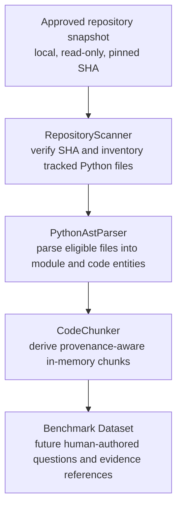

# Phase 9 — Corpus Preparation Workflow

**Status:** Documentation of the existing preprocessing path and the controlled handoff to a future benchmark dataset. No implementation changes are made by this document. No benchmark questions are created here.

## Intended flow

The data path is local. Scanner manifests, per-file parse/chunk artifacts, reports, and any eventual benchmark dataset containing source-derived details stay outside the thesis Git repository. Only non-sensitive protocol documentation and approved aggregate results are committed.

## Stage descriptions

### 1. Repository snapshot

Acquire an already-approved repository revision through the controlled public-repository acquisition procedure. Use a detached checkout at the exact 40-character SHA recorded in [corpus-final-selection.md](corpus-final-selection.md). Keep the checkout read-only and outside the thesis repository (the validated location is `C:\Apps\Temp\Phase5.4\corpus`). The scanner must not acquire, fetch, switch, or modify the snapshot.

Before source processing beyond the allowed preparation checks, satisfy the applicable repository-specific secret, personal/confidential-data, license-notice, access-control, and approval gates. A successful parse or chunk count is not privacy clearance. Do not submit source to external AI services.

### 2. Scanner

`RepositoryScanner` verifies that the supplied path is a Git working-tree root and that `HEAD` equals the expected full SHA. It enumerates the committed Git tree and reads eligible file bytes from local Git blob objects. It considers tracked `.py` paths, applies the versioned `phase4.5-python-v1` exclusions, and records eligible Python file hashes, sizes, and LOC alongside excluded candidates and reasons.

The scanner does not clone/fetch, make API calls, parse code, or write into the checkout. `scan_to_file(...)` refuses a manifest destination inside the source repository. Per-file manifests are source-derived metadata and must remain external to Git.

### 3. AST parser

`PythonAstParser` receives locally decoded source text and extracts module metadata, imports, classes, functions, methods, and their source ranges using Python's standard `ast` module. It does not modify source or invoke external services. Syntax failures are represented with stable path/location/message metadata; do not place source text in routine reports or logs.

The runner reads files using Python's encoding-cookie-aware text reader and accounts for parse failures rather than silently dropping them. Parse outputs and detailed file-level diagnostics remain in the controlled local research-data area.

### 4. Chunker

`CodeChunker` receives the parsed module, the same decoded source text, and verified repository metadata. It derives module, class, function, and method chunks by slicing the AST-recorded line spans. Each chunk carries provenance (repository, SHA, relative path, entity, and line range) and a stable content-derived identifier. Chunks are in-memory, source-derived data; the chunker itself does not persist them or construct an index.

The existing chunker intentionally allows parent/child overlap (for example, a class chunk and separate method chunks). It has no fixed-size split/truncation policy. Oversized chunks and any later splitting policy require a separate versioned decision; do not change chunker behavior as part of Phase 9 corpus documentation.

### 5. Benchmark dataset handoff — future, not executed

A later, authorized benchmark preparation step may use approved chunk provenance to author questions and gold evidence references under the already-established benchmark schema and annotation protocol. Questions, source-derived details, chunk IDs linked to source, evidence spans, and per-item audit decisions are source-derived or sensitive research artifacts: keep them locally, access-controlled, and outside Git. Commit only the approved schema/protocol documentation and non-sensitive aggregate counts.

This phase does **not** author questions, populate a dataset, inspect source for annotation, validate gold chunk references, or claim a benchmark dataset exists. Any future dataset construction remains blocked for snapshots without explicit privacy/handling clearance.

## Privacy-control verification for this workflow

| Control | Verification and boundary |
|---|---|
| No source uploaded externally | The reviewed scanner/parser/chunker and pipeline-validation design use local Git objects, local Python parsing, and in-memory slicing; the runner has no source-upload/API stage and does not call a hosted model. This is a code/design review, not packet-level monitoring or proof of every machine, IDE, or operating-system telemetry setting. Do not upload corpus source, chunks, questions containing source-derived details, manifests, or findings to external services. |
| Source repositories stay outside Git | The frozen snapshots and reports are documented under `C:\Apps\Temp\Phase5.4`, outside the thesis checkout at `C:\Apps\Explore\AI-Developer-Assistant`. The Phase 5.4.1 record reports that no corpus source was added to Git. Keep all future checkouts and source-derived files outside the repository; verify `git status` and tracked-file inventory before commit. |
| Only documentation goes into this repository | Phase 9 changes are limited to research documentation. Do not add source checkouts, source excerpts, raw chunks, detailed per-file manifests/audit outputs, benchmark items, embeddings, or indexes. |
| No benchmark questions now | Explicitly deferred. This workflow describes only the future handoff and does not authorize annotation. |
| Privacy approval remains scoped | Phase 8's **APPROVED WITH CONTROLS** is a thesis-level policy decision, not a repository-specific clearance. Existing records report unresolved scan findings and missing manual review; the humanize pilot remains blocked. Keep the applicable gates closed until an attributable repository-specific approval is recorded. |

Historical limitation: [privacy-review.md](privacy-review.md) records a conflict between the 2026-09-27 owner statement and prior records saying 13 eligible pilot source files were made available to an AI analysis agent. This workflow does not resolve or retroactively approve that event and does not claim that source was never exposed historically. Do not submit any further source to AI or other external services; retain any retrospective data-handling assessment separately.

## Existing validation baseline

The recorded Phase 5.4.1 run validated all nine pinned snapshots: 1,916 eligible Python files, 439,669 eligible LOC, zero parse failures, 33,415 deterministic chunks, and zero chunk-generation failures. Its aggregate pipeline report is outside Git and contains no source text, per-file paths, or checkout paths. The separate privacy gate remains open, so this preprocessing result is not authorization to index or annotate.

See [corpus-checkout-validation.md](corpus-checkout-validation.md), [pipeline-validation.md](pipeline-validation.md), [scanner design](../architecture/scanner-design.md), [AST parser design](../architecture/ast-parser-design.md), [chunker design](../architecture/chunker-design.md), and [ADR-008](../decisions/ADR-008-source-code-privacy.md).
