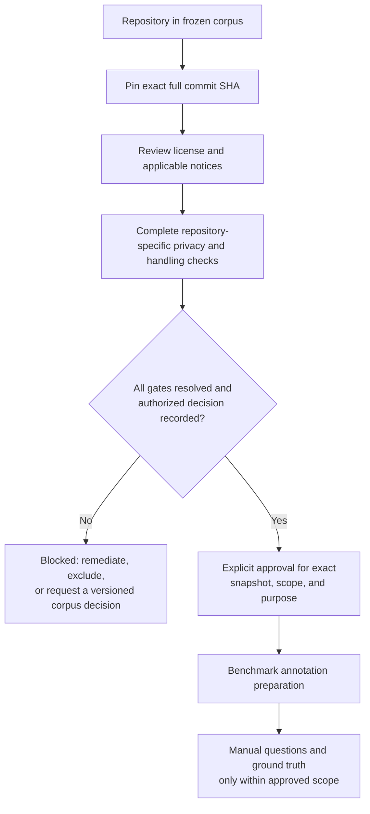

# Phase 11 — Repository Approval Workflow

**Status:** Approval preparation and workflow documentation only. This document does not itself review, clear, or approve any repository. Current repository-specific privacy records remain open; benchmark question creation and source-derived annotation remain blocked until explicit approval is recorded for each exact snapshot and purpose.

## Approval flow

The approval sequence is **Repository → Commit Pinning → License Check → Privacy Check → Approval → Benchmark Annotation**. A gate marked `PASS` must have attributable evidence; blank fields, project ownership, public availability, a general policy, and automated test/preprocessing results are not approvals.

## 1. Repository selection

Start with one repository from the nine-member frozen corpus in [corpus-final-selection.md](corpus-final-selection.md). Open one [repository approval record](repository-approval-template.md) per repository/snapshot. Capture its canonical owner/repository name, URL, current frozen membership, study language scope, and size stratum. Existing selection metadata is screening evidence; do not treat it as a repository-specific clearance.

If a repository must be excluded or replaced, stop and document a versioned corpus decision, recalculate the eligible counts/strata, and reconcile the benchmark allocation before annotation. Do not quietly choose a replacement or use a different upstream project.

## 2. Commit pinning and checkout verification

Record and verify the exact 40-character SHA from the frozen snapshot map. A branch, tag, default branch, or newly fetched latest revision is not equivalent. Use an already acquired local checkout outside the thesis Git repository; verify `HEAD`, detached/read-only handling, and clean tracked state without modifying source. Record only safe evidence references/digests in the approval record; detailed checkout and file-manifest data remains external.

A SHA/file-count/preprocessing check establishes identity and preprocessing facts only. It does not establish that source is safe or permitted for annotation. A changed SHA, filter, language scope, or manifest requires review again and a documented protocol/corpus update.

## 3. License and notice check

Verify the root license text and applicable terms at the exact pinned snapshot. Review notices and license headers that apply to the proposed eligible file scope, record attribution/retention requirements and exclusions, and obtain legal or repository-owner review where required. The listed root license identifier is not blanket permission, legal advice, or proof that every file has the same terms.

If terms, notices, or redistribution/retention conditions are unclear, mark the gate `BLOCKED` and do not use the affected material. Keep detailed file-level notice inventories and any restricted legal advice outside Git; the committed record should state only a non-sensitive status and evidence reference.

## 4. Repository-specific privacy and data-handling check

The designated reviewers must close each applicable gate for the exact repository and SHA. At minimum:

1. **Secret/credential scan:** record scanner/version, configuration, exact snapshot scope, date, output digest/reference, and the disposition of every candidate. A zero-result report is only a result within its evidenced scan scope.
2. **History coverage:** record scanned refs/range and whether history was complete or shallow. Resolve tool errors, or have an authorized approver explicitly assess and accept a documented limitation and residual risk. Never describe a shallow scan as full-history clearance.
3. **Personal/confidential-data review:** a designated human reviewer examines the approved scope and records method/categories, result, exclusions, reviewer, date, and evidence. A secret scan does not replace this assessment.
4. **Manifest and exclusions:** reconcile the approved filter/version, file scope, exclusions, and aggregate file/LOC counts to the exact SHA. Detailed file paths, per-file hashes, and reports stay external.
5. **Handling controls:** confirm controlled local storage, owner-limited access, local/offline processing, optional telemetry settings/limitations, encrypted restricted backups, retention, and deletion. Location outside Git alone does not prove access control.
6. **Historical exposure or incidents:** where earlier records identify a potential exposure or conflict, document a separate retrospective assessment with the authorized reviewer. Do not silently erase or reinterpret that history as approval.

Any unresolved candidate, scope gap, missing reviewer, unclear handling control, or failed check keeps the snapshot blocked unless an authorized approver has explicitly accepted the precisely documented risk and the intended activity remains permitted. If processing cannot be justified, exclude the repository through the versioned corpus procedure.

## 5. Approval decision

After the identity, license, privacy, manifest, and handling evidence is assembled, the authorized approver completes the record. The decision must be explicit, attributable, dated, and bound to:

- canonical repository identity and exact full commit SHA;
- approved language/files, filter and manifest version, exclusions, and any accepted history limitation;
- permitted purpose, such as manual benchmark question and evidence annotation;
- source handling, access, retention/deletion controls;
- conditions, stop triggers, residual risks, and evidence references/digests.

Use `APPROVED`, `APPROVED WITH CONTROLS`, or `REJECTED`; an empty field, reviewer recommendation, thesis-level policy approval, and passing automated checks are not an authorized approval. If a control fails or conditions cannot be maintained, suspend use and return to the approver. Approval for annotation does not, by implication, authorize indexing, embeddings, retrieval, experiments, external transmission, or source publication; those activities retain their own gates.

## 6. Benchmark annotation handoff

Only after the explicit approval covers annotation for the exact snapshot may the researcher proceed to annotation preparation:

1. Reconfirm the approved repository/SHA and allowed file manifest; keep checkout read-only and all detailed source-derived artifacts outside Git.
2. Follow [corpus-preparation-workflow.md](corpus-preparation-workflow.md) for the already-defined scanner → parser → chunker path, and use only the matching deterministic inventory when creating evidence references. Do not change chunk boundaries or IDs for annotation.
3. Follow [benchmark-schema.md](benchmark-schema.md) and [benchmark-generation-workflow.md](benchmark-generation-workflow.md). Predeclare the category/difficulty mix, held-out split, pilot exclusion, and independent-review sample before authoring.
4. Create questions manually from approved static evidence. Record exact chunk IDs, primary/supporting integer grades, source spans, rationale, ambiguity, and review outcome in the controlled external annotation record. Do not use retriever rankings or unreviewed generated labels as ground truth.
5. Keep question text, chunk inventories, IDs/provenance, file paths/spans, ledgers, and review evidence outside Git. Only aggregate, non-sensitive readiness information may be committed.

Annotation preparation is still not retrieval evaluation. Benchmark validation and freeze must be complete, and all separate corpus/experiment gates must close, before any retrieval experiment begins.

## Current readiness and stop condition

The committed records currently state that corpus-wide secret/privacy findings and personal/confidential-data reviews are unresolved, the scan histories are shallow, license/file-notice review remains incomplete for parts of the corpus, and the humanize pilot is explicitly **NOT APPROVED — PILOT ANNOTATION REMAINS BLOCKED**. Accordingly, Phase 11 creates only the blank approval template and workflow; no repository is newly cleared here. Do not inspect source for benchmark authoring, consume a chunk inventory for annotation, or create questions until the applicable approval record is complete and explicitly authorizes that use.

The existing scanner/parser/chunker validation and unit tests do not close these gates. If a mandatory item cannot be resolved, record it as blocked and escalate to the designated reviewer; do not proceed by assumption.

## Related protocol

- [Repository approval record template](repository-approval-template.md)
- [Frozen corpus and privacy gate](corpus-final-selection.md)
- [Dataset snapshot freeze](dataset-snapshot-freeze.md)
- [Privacy clearance report](privacy-clearance-report.md)
- [Final pilot privacy review](pilot-privacy-final-review.md)
- [Benchmark annotation guide](benchmark-annotation-guide.md)
- [Benchmark annotation workflow](benchmark-annotation-workflow.md)
- [Benchmark schema](benchmark-schema.md)
- [Benchmark generation workflow](benchmark-generation-workflow.md)
- [ADR-008: source-code privacy](../decisions/ADR-008-source-code-privacy.md)
