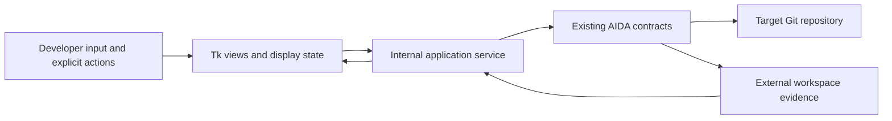

# AIDA UI v1 architecture

Date: 2026-10-08. Status: implementation-ready design, pending review; documentation only.

## Purpose

Implement the UI-first direction in the [post-roadmap product plan](post-roadmap-product-plan.md). Provide a local presentation and control layer over existing developer contracts. The Phase 65–72 roadmap is complete; this design assigns no new phase numbers and creates no Phase 73. Existing post-Phase-65 architecture decisions remain authoritative.

Inspected baseline: branch `main`, documentation authority `c28e89d8753e4c443d5e7384034e7126368a1ea6`, parent implementation authority `d81d2faec77ff755516c197d7295eac955457b69`, VERSION `0.1.1`, clean working tree and empty staging. Findings below are static source/document/test inspection, not new runtime validation. No dependencies, UI modules, or execution behavior are changed by this document.

UI v1 imports externally authored candidate patches. It guides explicit individual actions; it does not generate patches/tests or run an autonomous pipeline. The target is a solo developer using Windows with the existing Python environment and local model cache.

## Current backend capabilities

The following mapping comes from actual functions and CLI dispatch, not anticipated roadmap features. Paths are relative to the repository; links resolve to the inspected source.

| Responsibility | Current backend entrypoint / contract | Important behavior |
| --- | --- | --- |
| Repository inventory | [local_workflow.py](../src/developer/local_workflow.py): `scan_local_repository(repository)` → `LocalInventory` | Existing Git working-tree root and HEAD; repository ID and Python-source fingerprint; supported languages `python`. No external run is created by this inventory function. |
| Explicit scan | `DeveloperWorkspace.scan(repository)` | Source read only; creates external `scan` run. |
| Explicit index/reindex | `DeveloperWorkspace.index(repository)` | Current local dense/BM25 index and `index` run; may reuse an identical snapshot. Uses existing pinned local embedding model; no UI model acquisition. |
| Coverage inspection | `DeveloperWorkspace.inspect(repository, changes=False)` | Coverage/chunk/parser diagnostics and external `inspect` run; optional detail action, not the default read-only status refresh. |
| Goal planning | [implementation_planning.py](../src/developer/implementation_planning.py): `plan_change(workspace, repository, goal=..., base=None, top_k=10, expected_tests=())` | Phase 65 delegates to Phase 64 `analyze_change_impact`; creates linked impact and plan runs; includes Phase 66 `ProposedAction`. Status: `completed`, `limited`, `manual_review_required`. No code drafting or tests. |
| Source-plan check | [proposal_evidence.py](../src/developer/proposal_evidence.py): `validated_plan(workspace, repository, run_id, require_current=True)` | Canonical plan/impact and typed proposal validation, current binding and exact expected tests; only a `completed` plan qualifies. Calls workspace preparation and may initialize external directories. |
| Supplied patch validation | [patch_drafting.py](../src/developer/patch_drafting.py): `draft_patch(workspace, repository, proposal, SuppliedPatchGenerator(text), plan_run_id=...)` | Phase 67 public function repeats validated-plan checks. Produces `draft` or `blocked`; invalid structure/scope can raise without a draft. Use the public function, never `_draft_patch_candidate`, which exists for low-level fixtures. |
| Decision | [patch_authorization.py](../src/developer/patch_authorization.py): `record_patch_decision(workspace, repository, patch_run_id, decision, approved_by=..., note=...)` | Explicit `approve`/`reject`; `AuthorizationRecord`; external command name is `review-patch`. Approval permits only `apply_exact_patch`; it does not execute or authorize tests. A blocked draft can be rejected, never approved. |
| Apply | [patch_application.py](../src/developer/patch_application.py): `apply_approved_patch(workspace, repository, authorization_run_id)` | Phase 69 requires clean Git state, exact approved bindings and no replay; applies exact existing-file Python patch with no fuzzy matching; records `applied` or failure evidence when possible. |
| Test | [test_execution.py](../src/developer/test_execution.py): `execute_applied_patch_tests(workspace, repository, execution_run_id, tests=())` | Phase 70 explicit invocation authorizes bounded unittest execution. For the public plan-linked path, omitted selectors mean the exact bound Phase 65 set; explicit selectors must equal that complete set. Observation: `passed`, `failed`, `error`. |
| Verify | [execution_verification.py](../src/developer/execution_verification.py): `verify_execution(workspace, repository, execution_run_id, observation_run_id)` | Phase 71 resolves and checks exact upstream evidence, tests, scope, state and byte postimages. Status: `verified`, `not_verified`, `uncertain`. No automatic recovery or closure. |
| Evaluate | [recovery_evaluation.py](../src/developer/recovery_evaluation.py): `evaluate_recovery(workspace, repository, verification_run_id)` | Phase 72 read-only recovery evaluation; `RecoveryEvaluation`; no retry/rollback execution or lifecycle transition. |

[cli.py](../src/cli.py) exposes the equivalent `local scan`, `index`, `inspect`, `plan-change`, `draft-patch`, `approve-patch`, `reject-patch`, `apply-patch`, `test-applied-patch`, `verify-execution`, `evaluate-recovery` commands. Its patch-file path check requires the supplied file to be outside the target repository. The UI adapter must preserve that input boundary.

Existing expected-test binding is regression selection, not future feature-specific test planning. `src.developer_testing.catalog(repository)` lists existing exact unittest identities. If automatic static selection is unknown, a developer can choose existing methods and explicitly replan with `expected_tests`; UI v1 cannot invent new tests. Phase 70 may execute target code with local-user privileges and reports repository side effects; it is not an OS sandbox.

Existing documentation: [65](research/phase65-evidence-grounded-implementation-planning.md), [66](research/phase66-typed-proposed-action-contract.md), [67](research/phase67-evidence-grounded-patch-drafting.md), [68](research/phase68-human-patch-approval.md), [69](research/phase69-controlled-patch-application.md), [70](research/phase70-authorized-test-execution-observation.md), [71](research/phase71-execution-verification.md), [72](research/phase72-controlled-follow-up-recovery.md). Older deferred-work paragraphs describe historical phase boundaries; current functions and post-roadmap integration notes govern capability mapping here.

## Technology decision

Recommend **Python desktop UI using `tkinter` and themed `ttk` widgets**, with one process and a thin internal application service calling Python contracts. No HTTP listener, browser frontend, Node toolchain, cloud, database, or additional GUI package is required for v1.

Python documents Tkinter support on Windows and bundled Tcl/Tk in official Python binaries, while noting Tkinter is optional in some distributions. Check availability during future UI installation and report missing Tk explicitly; do not silently install or substitute a runtime. Use the existing Python 3.14 development environment and supported Python baseline. Proposed initial launch: `python -B -m src.ui`, with normal project installation and existing pinned backend dependencies. Do not promise a standalone executable; frozen Windows packaging is separate future work. [Python Tkinter documentation](https://docs.python.org/3.14/library/tkinter.html).

Use `ttk.Notebook`, `Treeview`, `Panedwindow`, labels, buttons and progress indicators for navigation/tables, plus a read-only monospace `Text` widget with tags and scrollbars for unified diffs. These are sufficient for v1's diff/history/status display. Prefer Windows theme defaults and system fonts; allow resizing and keyboard navigation. Rich IDE editing and syntax highlighting are outside v1. [Python ttk documentation](https://docs.python.org/3.14/library/tkinter.ttk.html).

The recommendation is a project-specific engineering judgment: modest appearance and manual text tagging are acceptable in exchange for direct Python integration and simpler local operation.

## Alternatives considered

| Criterion | Tkinter/ttk desktop — selected | PySide6 desktop | Python-served local web UI |
| --- | --- | --- | --- |
| Integration effort | Direct Python calls; small widget layer | Direct Python calls; additional Qt API/runtime | Python handlers plus browser request/response layer |
| Packaging complexity | Existing environment plus available Tcl/Tk | Additional Qt binaries/plugins and deployment tooling | Web assets, framework/server and browser launch/port lifecycle |
| Safety boundary clarity | No network boundary; service is sole call path | Similar local boundary | Must also protect local requests, origins, sessions and write endpoints |
| Developer ergonomics | Native file dialogs; adequate tables/diffs | Better rich text and visual tooling | Strong HTML/CSS diff layout |
| Maintainability | One Python stack; simple views | Larger toolkit/dependency surface | Python plus browser presentation code |
| Testability | Pure service/state tests plus widget tests | Pure tests plus Qt event-loop tests | Pure tests plus HTTP/browser tests |
| Windows usability | Standard themed controls, environment launch | Strong desktop fit, extra distribution work | Browser fit, extra service management |
| Diff/history/status | Text tags and tree tables are sufficient | Richer than required initially | Richer layout, added boundary cost |

Reject PySide6 for initial v1 because its extra runtime/deployment surface is unnecessary for this scope; revisit only if native-widget requirements outgrow Tk. Qt's official deployment guidance describes its deployment tools and Windows support. [Qt deployment](https://doc.qt.io/qtforpython-6/deployment/index.html).

Reject a local web UI for initial v1 because it introduces a server and request security work without a current browser requirement. A real distribution would need an appropriate server, not Flask's development server. This is an architecture tradeoff, not a claim that web UIs cannot be safe. [Flask deployment documentation](https://flask.palletsprojects.com/en/stable/deploying/).

## Trust boundary



The UI collects input, requests a named operation, displays backend results, and presents approval/rejection controls. It cannot create authorization, widen scope, recalculate a verified verdict, or replace canonical evidence with convenience state. Enablement is guidance and never permission. Even if a button is invoked directly or cached state is forged, the service calls the existing backend operation, whose validators still decide validity.

The backend owns repository identity, HEAD/source/Git binding, proposal validity, patch paths and symbols, authorization, exact mutation, test selection/authorization, verification and recovery classification. No UI parser or renderer becomes a scope validator. No UI hashing code replaces backend hashes. No HTML/script execution, arbitrary shell entry, patch editor, Git stage/commit/push/reset, or recovery executor is exposed.

Branch names are not fields in Phase 66/68 records: source fingerprints bind HEAD and eligible Python content, not a symbolic branch name. Existing later contracts also check Git index/refs/state. Do not claim comprehensive branch binding already exists. The internal service adds a conservative session branch-change stop using read-only Git facts; that guard never grants permission or changes a contract. A same-HEAD branch switch requires deliberate session reload/replanning in v1. Persisted UI branch preference cannot authorize continuation after restart.

## Backend integration design

Choose **C: a small in-process application-service layer wrapping existing Python contracts**. The layer uses direct calls (A) internally. Reject scattered direct calls from widgets and CLI subprocess dispatch (B): the latter adds process/JSON/error framing and output capture without an isolation need. Never call private CLI dispatchers or synthesize argparse namespaces.

Proposed service operations:

| Service method | Inputs beyond fixed repository/workspace context | Existing call |
| --- | --- | --- |
| `read_repository` | none | Non-writing backend read facade described below |
| `scan`, `index`, `inspect` | explicit action; inspect detail flag | Corresponding `DeveloperWorkspace` method |
| `plan` | goal, optional base, top_k, existing expected methods | `plan_change` |
| `import_candidate` | source patch path, exact plan run ID | Read UTF-8 once after CLI-equivalent outside-repository check; `validated_plan`; public `draft_patch` with `SuppliedPatchGenerator` |
| `review_patch` | exact patch run ID | Backend read facade using existing canonical patch loader |
| `decide` | exact patch run ID, `approve` or `reject`, audit label, optional note | `record_patch_decision` |
| `apply` | exact authorization run ID | `apply_approved_patch` |
| `test` | exact execution run ID | `execute_applied_patch_tests(..., tests=())`; no post-approval selector editing |
| `verify` | exact execution and observation run IDs | `verify_execution` |
| `evaluate` | exact verification run ID | `evaluate_recovery` |
| `list_history`, `read_record` | repository filter, explicit selected run ID/type | Non-writing backend read facade |

Every call uses the selected workspace and resolved target root, preserving the CLI's configured research-root isolation via `load_config` and the same `data_root`, `corpus_root`, `validation_output` roots. No `RunTracker` is used: it belongs to separate research tracking. Returns retain untouched backend payload plus separate presentation metadata: request token, operation name, loading/error information. Presentation metadata is never written into canonical run payloads.

The service may validate input shape, route calls, serialize operations, load evidence through existing readers and translate errors. It must not derive allowed scope, reimplement validators, reinterpret warning categories to authorize progress, select a different test set, apply patches itself, perform retries, or chain phases. A successful result only makes the next explicit action visible. Exceptions retain exact backend reason; do not fabricate a run ID if none was written.

### Internal service layer is an adapter, not a second backend

The service may call existing AIDA Python functions, load existing evidence, normalize responses for presentation, format developer-friendly summaries, expose narrow read helpers and coordinate one explicitly requested operation at a time. Normalization preserves the authoritative payload rather than replacing its meaning.

It must not independently determine patch validity, authorized scope, matching repository bindings, permission to mutate, test authorization, verification success or whether recovery is required. Existing Phase 65–72 contracts make those decisions. Service/session guards may conservatively stop a request, but cannot grant authority. No UI/service duplicate of backend safety logic is permitted.

### Every sensitive transition re-enters backend validation

Cached Tk/view flags such as `approved = true`, `ready_to_apply = true`, `tests_passed = true` or `verified = true` are display state only. Before any sensitive downstream action the adapter loads/passes the exact relevant evidence references and calls the existing backend contract, even when the last rendered screen looked ready:

| Explicit action | Authoritative input and revalidation owner |
| --- | --- |
| Apply | Exact Phase 68 authorization run ID; Phase 69 reloads authorization/draft and validates repository identity, HEAD/source/Git state, patch identity/hash and authorization binding. Branch-change session guard uses backend-read facts, preserving the existing limitation that symbolic branch name is not a Phase 68 field. |
| Test | Exact Phase 69 execution run ID; Phase 70 validates successful unchanged application, linked authorization/draft/plan and the exact bound test set before executing. |
| Verify | Exact execution and Phase 70 observation run IDs; Phase 71 loads their linked chain and determines `verified`, `not_verified` or `uncertain`. |
| Evaluate recovery | Exact Phase 71 verification run ID; Phase 72 validates the linked evidence/current state and classifies recovery. |

On authoritative drift, stop the invalid action, display the exact reason and preserve prior evidence. Do not silently refresh authorization, substitute another record, rerun upstream phases or trust a cached success flag. Loading an intact historical record is not proof that it remains valid for a new operation.

### Narrow read-facade dependencies for implementation

The read facade simplifies access only to existing facts: current repository status, scan/index freshness, available lifecycle records, and proposal, patch, authorization, execution, observation, verification and recovery summaries. It may gather data, normalize records and format stable view models. It must not invent lifecycle state, infer authorization, repair malformed evidence, independently classify verification/recovery, override backend statuses or bypass validators. If existing backend evidence cannot establish a fact, return explicit unavailable/unknown/error information. Presentation normalization must retain the original status, IDs, hashes and diagnostics.

The current backend has no unified public non-writing repository/history/review API. Do not disguise this as an existing feature. Plan a small `src/developer/ui_read.py` facade during UI implementation:

1. Repository display composes `scan_local_repository`, existing parsing/freshness helpers (`parse_local_repository`, `change_impact._index_freshness`) and fixed read-only Git calls for symbolic branch/detached HEAD and porcelain status. Reuse `patch_application._status` for status and the existing optional-lock-safe Git invocation pattern (`GIT_OPTIONAL_LOCKS=0`) for supplementary branch reads; the generic `local_workflow._git` helper does not itself disable optional locks. Reuse existing isolation/containment primitives for non-writing checks; expose the isolation-only portion of `_prepare` if needed rather than invoking its directory creation/write probe. Read version from installed metadata/current source and show source commit when available; report unknown authority rather than substituting the target repo's HEAD. This facade must not call `_prepare`, record runs, load/download a model, or repair a missing index. It uses existing freshness logic, not a parallel algorithm.
2. Review uses `_read_patch_run` to reconstruct the validated `PatchDraft`; current checks reuse `_check_repository`. Expose the exact patch-text SHA from a shared pure backend helper extracted from the existing Phase 68 hash expression, also used by Phase 68, without changing bytes or identity semantics. Before approval, label it a review digest, not an authorization. After approval use `AuthorizationRecord.patch_sha256`. No UI hash computation or verification algorithm is added.
3. History discovery enumerates contained run directories without `_prepare`. Existing lifecycle kinds reuse `execution_verification._read_run`, `_read_patch_run`, `_load_authorization`, and `_read_execution` as appropriate. Add scan/index/inspect/recovery command-mode mappings to a shared backend record reader by exposing/refactoring the existing canonical reader; do not copy its content-identity algorithm into UI code. Recovery display reconstructs `RecoveryEvaluation`; execution-sensitive use always goes back through `evaluate_recovery` and its `_require_verification`/linked checks. Existing execution behavior and record identities must remain unchanged.
4. Separate envelope validity from phase-chain validity and current-state validity. History browsing alone never asserts a currently valid authorization or execution chain. Unreadable/unknown schemas remain visible as unavailable history entries; downstream actions are disabled. Rendering an intact historical `verified` record means “verified at that recorded state,” not that the current repo is verified.

These are bounded read/presentation integration changes for future implementation, not new productivity capabilities. Keep all existing validators in the backend, with characterization tests proving that exposure/refactoring preserves their behavior. No such helper or refactor is implemented in this documentation task.

### Scheduling, concurrency and interruption

Tk widgets live on the main thread. Use one non-daemon worker and a queue for service calls/results; poll the queue using `after`. Long backend operations must not block the Tk event loop. Python describes the event-loop/thread constraints; worker code never touches widgets. [Tkinter threading model](https://docs.python.org/3.14/library/tkinter.html#threading-model).

Submit potentially noticeable reads and operations through this same worker: repository refresh, scan, index, planning, candidate validation, decisions/application, test execution, verification, recovery evaluation and large history/evidence loads. Each submitted request contains one named operation and immutable input IDs/context; completion posts either the untouched backend result or an error envelope to the main-loop queue. Only the main loop updates widgets and releases busy controls. The worker exists solely for responsiveness: it never retries, approves, repairs, starts the next phase or interprets a failure as permission for another operation. No distributed task system, web queue, async server or job framework is needed.

Permit one outstanding operation for the selected session. Disable repo/workspace switching and action controls while busy; deduplicate double-clicks. Attach a session generation and request token to each result so stale completions cannot update a different session. Never use global stdout redirection in a worker; capture structured returns/errors, leaving backend console diagnostics out of the primary UI. V1 progress is “running” and stage-level completion; no invented percentage or live test stream.

Do not offer forced cancellation of Apply/Test: current contracts have no safe cancellation API. Keep the window open while an operation runs; closing requires waiting for completion. If the process is killed or crashes, label the last attempt outcome unknown and inspect existing evidence on reopen; never rerun, infer successful mutation, or recover automatically. The UI serializes its own calls but is not a cross-process lock or OS sandbox; existing backend race checks remain authoritative.

## UI information architecture

Use one window, a persistent repository/workspace header, and four tabs:

| Tab | Functional responsibilities |
| --- | --- |
| Project | Repository selection, branch/HEAD/state, workspace, explicit scan/index and freshness |
| Plan & Review | Developer Goal, Phase 65 Evidence/Plan and Phase 66 bindings, candidate import/Phase 67, exact diff, and explicit Approval/rejection section |
| Run & Result | Explicit Execution timeline, Verification Result and separate Recovery evaluation |
| History | Evidence/History with linked-record drill-down |

Plan & Review uses ordered sections rather than three separate navigation pages. History stays accessible when progress is blocked. Use text/icons as well as color for status. Keyboard focus must never land on approval as the default Enter action. Avoid dashboards, accounts, role management, or multi-project batch controls. One repository and one selected lifecycle chain are active at a time.

## Screen / functional-area design

### Repository

Display resolved path, backend repository ID, branch or detached label, HEAD, clean/dirty state, workspace, index freshness, latest explicitly selected scan/index records, actual supported languages, AIDA version and available source authority. Distinguish “not scanned in this session” from “index missing.” Open/Refresh uses the non-writing read facade; Scan, Index/Reindex and optional Inspect are deliberate external-record operations. Opening a folder never fetches Git, installs dependencies, scans with a persisted run, or indexes automatically.

Invalid Git root, missing HEAD, workspace overlap, unavailable environment or malformed index shows an exact blocker. Dirty repositories may be inspected/planned; clearly indicate that Phase 69 requires clean state. The UI does not clean them. An expected applied patch leaves the repo dirty and must not be mistaken for unrelated drift.

### Goal

Place the multiline goal field, **Plan** button and optional “Existing regression tests / advanced” selector in Plan & Review. Project supplies its repository/workspace context. Show the example Decimal goal from the product plan. Default `top_k=10`, base omitted. Advanced top_k accepts the backend's 1–50 range; test choices come only from `catalog`. Blank goal is a local input error and is also rejected by `plan_change`. Surface all backend errors. Unknown test binding prompts deliberate selection of existing methods and a new Plan action; never silently replan.

### Evidence / Plan

Display implementation targets grouped by backend role, file/symbol locations, preserved behavior, exact bound tests and selection confidence/source, evidence references, recommended validation, plan run ID and proposal action ID. Do not invent a numeric confidence score; show existing qualitative/static-evidence limits.

Use separate visible lists: blockers/unresolved required evidence, warnings/informational evidence, and established supporting evidence. Preserve backend warnings including oversized-container retained-leaf proof diagnostics. No client rule may downgrade an unresolved item. A `limited` or `manual_review_required` plan stays browsable with a “Plan blocked for candidate validation” summary; `completed` is only an eligibility hint pending `validated_plan` at import.

### Proposed Change

Select an external UTF-8 candidate file, then explicitly **Validate imported patch** through Phase 67. The selected path is input provenance; the returned stored `patch_text` is the review body. Keep source input preview clearly marked unvalidated. Once accepted, do not reread the external file to substitute another diff into review or application. Changing the file/path requires a new import and Phase 67 invocation, invalidating selected downstream IDs in the session.

Display exact accepted diff, `candidate_paths`, `candidate_symbol_scope`, allowed `target_paths`/`allowed_symbol_scope`, patch ID/run ID, source plan/action IDs, backend review digest, warnings and blockers. A strict subset is permitted; do not flag it as a mismatch. Out-of-scope diagnostics come from Phase 67, not the renderer. A blocked draft retains no validated patch body; label any input preview accordingly. Exceptions that create no draft get an error entry, never a pretend patch ID. Rejection may be offered for an intact blocked draft.

Unified diff requirements: one file heading per paired `---`/`+++` section, verbatim hunk headers, old/new line-number gutters, explicit `+`/`-` markers and addition/deletion tags, unchanged context and no-newline markers preserved, horizontal/vertical scrolling and selectable text. Group backend path-qualified changed symbols beside each file and show allowed versus actual scope with backend warning messages. Parsing for line presentation grants no scope permission. The authoritative raw text remains available without normalization; no editing, formatting, hunk selection, partial application or approval of a hidden subset. To change a candidate, import a new file and rerun Phase 67.

Keep v1 a read-only diff viewer, with visible warnings/blockers and patch SHA in review/approval; do not embed a code editor. Never modify a validated patch in UI state. A changed candidate requires a new explicit selection/import and Phase 67 validation, obtaining the backend's content-derived patch identity/binding before review. Identical candidate content may retain its deterministic identity; a changed body cannot inherit the old approval.

### Approval

Read the exact canonical draft and linked plan for the review surface. Show goal, primary targets, files/symbols, exact patch, bound tests, warnings, repository ID/path/HEAD/source-state binding and full patch SHA. Enable APPROVE only for a current accepted draft; backend validation still repeats on decision. REJECT does not grant authority. An invalid/missing record cannot be rejected as if its identity were trusted.

### Execution

Four separate buttons: **Apply approved patch**, **Run bound tests**, **Verify execution**, **Evaluate recovery**. Each requires the exact prior run IDs shown beside it. Apply passes an authorization run ID only, never caller patch text. Test button authorizes the exact unchanged bound regression set through Phase 70; approval alone never runs tests. Verify and Evaluate are deliberate read/evidence operations, not automatic consequences of pass/failure.

Show operation, in-progress/completed status, returned IDs, backend outcomes, errors and evidence links. No “Run all,” scheduler, repair, automatic retry, automatic verification/evaluation, or rollback button. After test failure still allow explicit Verify to record findings, and Evaluate when a trustworthy Phase 71 record exists. Stop mutation/execution continuation on failure or drift; preserve diagnostic read-only paths.

### Verification Result

Display two distinct panels: Phase 71 verification verdict and Phase 72 recovery classification. `verified` is the only green verified verdict; `not_verified` is “NOT VERIFIED” with deviations, not a generic success/failure conversion. Exceptions are “verification blocked”; `uncertain` stays “UNCERTAIN.” Missing verdict is “not evaluated,” never failed or verified by inference.

Show expected/approved/actual paths and symbols, missing/unexpected tests, totals and skips, exit code, exact byte postimage evidence from Phase 69 and Phase 71 findings, current/historical state comparison, deviations, side effects and unresolved uncertainty. Phase 70 `passed` is not verified, and `no_recovery_required` is not verified. Display failed-tests, stale-repository, mismatch, side-effect and uncertainty classifications individually. Rollback feasibility/candidate details are read only and explicitly carry no execution authority. No lifecycle closure is inferred.

### Evidence / History

List repository-scoped scan/index/inspect, impact, plan/proposal, draft, decision, application, test observation, verification and recovery records. Selection opens a summary and exact links; no “latest” resolution for action inputs. Bindings use workspace plus repository plus run ID/type; proposal/patch/authorization IDs are not interchangeable with run IDs. After restart, explicitly choose a chain and review it; convenience preferences never resume authorized actions automatically.

## State machine

Every sensitive transition follows **user action → backend call → backend validation → new backend evidence → UI update from returned evidence**. Labels such as authorized evidence available, application completed, test observation available, verified and recovery evaluated describe actual selected records, never synthetic authority. There is no Approved → Applied transition triggered solely by a UI flag. Missing evidence prevents a successful transition even when an old view label suggested readiness.

Use independent dimensions, not one enum conflating verification and recovery: repository readiness, planning/candidate/review step, operation in flight, application/test outcome, verification verdict, recovery classification, and current-session freshness. UI labels below are presentation labels; literal backend values remain visible. All transitions require an initiating user action. Rendering/selection alone changes no evidence.

| From / action | Backend operation and required bindings | Successful display state | Failure / refusal |
| --- | --- | --- | --- |
| No repository → Open | Read facade; chosen Git root and workspace | Repository loaded; scan required (no selected scan), index required (missing/stale), or ready for goal (current) | No repository/blocked with exact reason; no initialization |
| Repository loaded / scan required → Scan | `workspace.scan(root)` | Scan recorded; derive index requirement from backend freshness | Keep prior evidence; scan error; no implicit Index |
| Index required → Index/Reindex | `workspace.index(root)`; explicit user action | Current index → ready for goal | Index required/blocked; preserve model/cache/index error; no download |
| Ready for goal or explicit limited-evidence planning → Plan | `plan_change`; goal, base/top_k, optional existing methods | Planning → plan ready if completed; candidate required | `limited`/`manual_review_required` → plan blocked; exception → planning blocked |
| Plan blocked → Replan | Explicitly changed input/selected existing tests or separately indexed repo; new `plan_change` | New plan selected, old chain historical | Still blocked; never inherit old downstream bindings |
| Plan ready / candidate required → Import & Validate | Exact plan run, validated proposal, imported text; public `draft_patch` | Candidate ready (`draft`) → awaiting approval | Candidate invalid on exception or `blocked`; no APPROVE |
| Awaiting approval → REJECT | Exact intact patch run; `record_patch_decision(..., 'reject')` | Rejected; no apply/test authority | Decision error; retain draft, no synthetic rejection |
| Awaiting approval → APPROVE then Confirm | Exact intact patch run plus human audit fields; `record_patch_decision(..., 'approve')` | Authorized (`allowed_operation=apply_exact_patch`); not applied | Binding/status error → review blocked; no authority |
| Authorized → Apply | Exact authorization run; `apply_approved_patch` | Applied plus execution run ID; expected dirty poststate | Apply failed/blocked; show restoration facts if returned/raised; no retry |
| Applied → Run bound tests | Exact execution run; `execute_applied_patch_tests(tests=())` | Tests passed / tests failed (`failed` or `error`) plus observation run | Preflight refusal → tests not executed; missing result → outcome unknown |
| Tests passed or tests failed → Verify | Exact execution + selected matching observation runs; `verify_execution` | Verified, verification failed (`not_verified`), or verification uncertain; recovery evaluation available if record trustworthy | Verification blocked on exception/unloadable evidence; no verdict manufactured |
| Recovery evaluation available → Evaluate | Exact verification run; `evaluate_recovery` | Separate no recovery required or follow-up required classification | Evaluation blocked; prior verdict retained as historical evidence |
| Follow-up required → Review/New goal | Read findings; new Plan only on explicit user request | Separate proposal chain if requested | No automatic mutation, rollback, retry or cleanup |
| Any state → Refresh / focus regain | Non-writing read facade; selected session facts | Retain state only when appropriate current facts match | Branch/HEAD/unexpected state change → stale session; downstream actions disabled |
| History → Select chain | Exact chosen run/type and linked backend readers | Read-only historical view; require explicit review before action | Ambiguous/missing links → history unavailable/blocked |

“Scan required” is a UI guidance state, not a new backend precondition: index/planning already perform their own inventory. A current index may permit planning without a separate persisted Scan run. Explicit limited-evidence planning can be useful for diagnosis; it never enables execution. After Apply, match against backend-recorded poststate rather than the pre-approval clean state. Do not compare physical `.git/index` cache bytes.

Switching repository/workspace, selecting another plan/candidate, editing goal/test choices, or observed drift clears active downstream selections in memory. It never deletes historical records or revokes/rewrites an authorization. A rejection is not a new backend revocation model; UI v1 does not pretend repeated decisions supersede earlier records. Prefer a new candidate/plan review rather than toggling a rejected session straight back to approval.

## Safety and fail-closed behavior

| Condition | Required handling |
| --- | --- |
| Branch switch, even same HEAD | Service session guard stops continuation; show previous/current branch; user reloads/replans; no automatic checkout. Backend contract checks remain unchanged. |
| HEAD or repository identity changes | Disable downstream operations; preserve historical evidence; replan/redraft/reapprove only through explicit new actions. |
| Unexpected worktree/staging/ref change | Stop next Apply/Test; show backend state reason. After Apply, expected authorized source changes are valid; unrelated drift remains blocked. Verify/Evaluate may still be explicitly attempted to record findings. |
| Candidate text/hash changes | Bound stored diff stays authoritative; backend loader mismatch blocks. New external input requires import + Phase 67; never silently refresh approved text. |
| Stale proposal/run or mismatched authorization | Existing backend readers/validators refuse; show exact error and input IDs; no fallback to another run or auto-approval. |
| Incomplete tests/log evidence | Show missing counts/logs/identities; no inferred pass. Use Phase 71 result, never derive verified from zero exit alone. |
| Phase 71 uncertainty | Prominent uncertainty; no verified badge; explicit evaluation may report `uncertain_verification`; no retry/recovery execution. |
| Workspace missing, unreadable, redirected or malformed records | Display unavailable evidence; do not create directories on browsing or restore records; block affected actions. Unrelated history can remain browsable. |
| Malformed/unknown backend payload | Display operation error and raw diagnostic detail; no success transition. An operation may already have run: do not claim “not applied” unless backend proves it. |
| Apply failure / restoration uncertainty | Preserve backend failure record/message. Existing Phase 69 internal failure restoration remains intact; UI adds no restoration or cleanup. Distinguish verified restoration from unknown/failed restoration. |
| Test side effect | Display exact paths/state facts; leave artifacts in place for human inspection; no automatic clean/revert. |
| Stale index | Show backend freshness reason; disable candidate/execution continuation from incomplete planning; Index/Reindex requires an explicit developer action, followed by explicit replanning. |
| Failed or incomplete test execution | Preserve observation/logs and exact failure/count/protocol reason; no inferred pass or automatic rerun. Explicit Verify may record findings when usable evidence exists; missing evidence blocks verification. |
| Backend exception or unexpected worker failure | Preserve existing records and request IDs; return the exact exception/available traceback to the main loop and disable invalid next actions. If completion cannot be established, label outcome unknown, never infer not-applied or successful execution. Inspect authoritative evidence before any deliberate new request. |

Freshness refresh is a non-writing observation, not reindexing, reapproval or a periodic execution loop. Service checks branch/context immediately before calls; existing mutation/test operations perform authoritative final checks. Read-only UI guards cannot eliminate external concurrent edits or replace those checks.

For every failure/drift case above: preserve existing records, show the exact available reason, disable invalid next actions and require explicit developer correction or a separately requested operation allowed by existing contracts. “Retry” is not a generic bypass: consumed application authorizations and Phase 72's ineligible retry boundary remain authoritative. Never silently rerun a prior phase, reindex, refresh approval, repair state or restart a failed worker operation.

## Approval UX

One explicit APPROVE button opens one focused confirmation showing goal, candidate files/symbols, repository HEAD, patch SHA and bound tests, with **Confirm approval** and Cancel. No typed phrase, checklist ceremony or repeated confirmations. Confirmation means “approve this exact patch for future application”; it does not mean Apply or Test. Use distinct controls with no default Enter activation. REJECT records a decision directly, with optional note.

Reload the canonical draft/current facts before showing confirmation. Lock selection while the dialog is open. If the selected IDs or session freshness change, dismiss the pending confirmation and show the blocker; never redirect it to a new draft. The backend repeats checks at Confirm. Audit label defaults to `local-developer` and is explicitly not authentication; backend limits are label ≤100 characters and optional note ≤500. The returned authorization ID/run and exact hash are shown after successful approval, with separate Apply action.

## Evidence/history model

`DeveloperWorkspace._record_run` stores content-addressed runs at `WORKSPACE/runs/<20-hex-run-id>/metadata.json` and `results.json`. Metadata schema is `developer-local-run-v1`; it includes command, repo ID/path, commit, source fingerprint and workspace digest. Results are the direct developer payload, not the outer research `RunTracker` envelope. The returned `run_id` is attached after recording and may be absent from persisted results; derive the displayed locator from validated metadata/directory, never alter stored payloads.

Commands to recognize: `scan`, `index`, `inspect`, `change-impact`, `plan-change`, `draft-patch`, `review-patch`, `apply-patch`, `test-applied-patch`, `verify-execution`, `evaluate-recovery`. Index identity is the `snapshot_id` selected by `active.json`, its manifest `working_tree_sha256`, and index run ID; the index operation returns `index_path`, not a standalone index-ID field. Do not invent a separate index-ID namespace. Phase 66 proposal is embedded in the Phase 65 run, not a separate run. Phase 70 logs live under `WORKSPACE/evidence/<observation-id>/stdout.log` and `stderr.log` and remain external.

Build an in-memory history list from contained directories and metadata, then load selected records through the backend facade. Filter by canonical repository identity/path. Include unavailable entries with reason rather than silently dropping malformed evidence. General run metadata has no timestamp: directory mtime may be shown as filesystem time and used for display sorting only, never as authority or a “latest valid run” rule. Use embedded timestamps where present. Do not create a new audit database or persistent index.

Follow stored references: draft `source_plan_run_id`; decision `source_patch_run_id`; execution's authorization/proposal/patch identities; observation's execution link; verification's execution/observation run IDs and evidence references; recovery's verification run ID. Where backend resolution uses IDs across runs, call its existing resolver and preserve ambiguity failures. Never select by a matching proposal ID alone or first/latest file.

Progressive disclosure: summary first (what changed, why, exact tests, blocking reasons, factual outcome), then expandable IDs/full SHA values, symbols, diagnostics, source evidence references and log detail. Raw canonical JSON is a read-only debug view. Paginate history and render large diffs/logs in chunks; indicate any view limit, offer remaining content and never truncate the authoritative artifact. Render all text literally, with no evaluation of escape sequences, commands or clickable content as executable instructions. Show full diff for review; do not conceal hidden hunks behind a success summary.

## Local workspace model

### UI persistence is non-authoritative

UI v1 may remember last repository/workspace paths, window size, selected tab and display preferences. It must not persist an approved patch, valid authorization, applied state, test success, verification success or recovery result as independent UI truth. Lifecycle statuses are reconstructed from authoritative AIDA records and current backend validation when relevant. If remembered convenience state disagrees with backend evidence, backend evidence wins; preferences cannot resume a lifecycle or enable an action.

Reuse `src.config.load_config` and explicit UI workspace selection. Default remains `~/.prototype/developer-workspace`; explicit per-session override wins, then existing environment/config selection. The repository is chosen via native directory dialog or a path field; require the actual Git root, including valid linked-worktree roots where backend permits them. Display resolved paths before an operation.

Existing index namespace is `indexes/<safe-repository-id>/v5/` with `active.json` pointing to immutable snapshots; model cache and temporary workspace data remain in their existing namespaces. The UI does not move or migrate them. Missing model/cache prerequisites are explicit blockers with existing manual setup guidance; no network download or installation occurs on opening a repo or indexing through UI convenience code.

Optional UI preferences: `%LOCALAPPDATA%/AIDA/ui-v1/preferences.json`, falling back to `~/.prototype/ui-v1/preferences.json` only when LOCALAPPDATA is unavailable. Persist only last repo/workspace paths, geometry and selected tab. Create preferences on explicit Save settings or normal exit, after backend isolation/containment checks ensure that directory is outside target/AIDA/protected research roots. Failure to save is a visible convenience warning; it grants no permission and never changes evidence. Do not store goals, patch bodies, approvals, verdicts or active execution status there. Session IDs/results stay in memory; history is reconstructed from evidence.

Opening and browsing are non-writing. Explicit backend actions may initialize their external workspace through existing `_prepare`; show this consequence. No generated UI state goes into target repos. The existing Phase 69 temporary file replacement/restoration mechanics remain backend-owned and are not an additional UI persistence scheme.

## Proposed source structure

All entries below are proposed, not created:

```text
src/ui/
  __init__.py          # no backend work at import
  __main__.py          # module launcher; no CLI changes required initially
  app.py              # Tk window, worker queue, lifecycle/close behavior
  service.py          # small typed adapter; explicit calls and context guard
  state.py            # presentation state and enablement; no authority
  views.py            # four tabs and approval dialog, eight responsibilities
  diff_view.py        # literal read-only unified diff rendering
  formatters.py       # evidence, status and error summaries
  preferences.py      # optional isolated convenience persistence
src/developer/ui_read.py  # backend read facade over existing helpers
tests/
  test_ui_service.py
  test_ui_state.py
  test_ui_read.py
  test_ui_widgets.py
  test_ui_workflow.py
```

Keep one service, one presentation-state model and one views module until size requires a split. No dependency-injection framework, event bus, public network API, repository abstraction replacement or new evidence schema. Function signatures and returned dictionaries stay close to existing contracts. Small shared-reader/hash-helper exposure is the only anticipated supporting backend refactor; it must preserve identities and execution behavior.

## Testing strategy

This document plans tests; none are run or implemented for this documentation-only change. Future implementation follows [AGENTS.md](../AGENTS.md): directly affected feedback first, one appropriate completion gate, exhaustive acceptance where policy requires it. Package-initializer changes and milestone completion require stronger coverage. Generated fixtures/logs/indexes/cache stay outside the checkout, using Python `-B`; record terminal counts/exit status and report skips honestly.

### Backend adapter and read-facade tests

Use call-spy unit tests for exact operation signatures, workspace/repository and run-ID preservation, supplied-patch public path, complete bound tests, error propagation, operation serialization and stale completion suppression. Meaningful real-backend fixture tests confirm refusal even when presentation flags are forged. Review/browse tests prove no `_prepare`, external writes, model loading, or mutations; reader characterization proves canonical identities and existing CLI behavior unchanged.

Cover external candidate boundary, UTF-8/malformed candidate, strict allowed-scope subset, sibling-symbol rejection, changed hash, source-plan tampering, cross-workspace/repository IDs, missing/malformed records, ambiguous links, unsupported schemas, branch-only same-HEAD switch, HEAD/worktree/staged/ref drift and unavailable logs. Verify review SHA equals the unchanged Phase 68 calculation. Source fingerprint coverage is Python-specific; Git state checks remain necessary.

Existing coverage to preserve: `test_implementation_planning.py` (exact tests, unknown tests, clean-start lifecycle and container proof), `test_patch_drafting.py` (public validated-plan requirement, scope and stale-state refusal), `test_patch_authorization.py` (blocked approval, rejection and hash/state tampering), `test_patch_application.py` (replay, exact bytes, semantic index and restoration), `test_test_execution_observation.py` (Phase 70 plus Phase 71; exact selection, uncertainty, postimages, logs and side effects), `test_recovery_evaluation.py` (all classifications, ambiguous evidence and non-executing recovery). Phase 71 tests are in the observation module; do not assume a separate verification test file exists.

### UI state and widget tests

Test no approval for blocked/invalid Phase 67; no apply without a real selected Phase 68 approval; no tests merely from approval; exact selected IDs required; passed tests cannot manufacture verified; uncertain/missing verdict cannot display verified; recovery status remains independent; dirty authorized poststate is not false drift; actual drift disables continuation. A forged `authorized` view flag must still fail at the backend.

Drive real button/dialog callbacks on Windows/Tk with injected fixture service for event wiring: viewing a patch makes zero decision calls, confirmation calls once, Cancel calls none, Enter does not approve, double-click does not duplicate, selection stays locked while busy, and controls show returned warnings/errors. Assert read-only diff text exactly matches backend text, additions/deletions have tags, file grouping and allowed/actual symbol labels are correct, and hidden detail never removes blockers. Use accessible text assertions and widgets, not screenshot-only acceptance.

### Thin end-to-end UI smoke test

Create a disposable local Python Git root and separate workspace, existing exact unittest regressions, and an external supplied candidate. Drive the UI callbacks and actual service/backend path: open/status → explicit scan/index → enter goal/Plan → inspect evidence → import/Phase 67 → review/Confirm approval → Apply → explicit Test → explicit Verify → explicit Evaluate → history/result inspection.

A deterministic fixture embedder/retrieval setup may be injected for fast tests, clearly reported as stubbed; no remote model download. Final Windows acceptance also exercises the existing pinned local model/cache and installed environment; if unavailable, report that acceptance blocked, not fully complete. Use fresh fixtures for rejection, stale branch/HEAD, failed tests and uncertainty; verify no mutation before approval, exact changed set/postimages after Apply, unchanged HEAD/staging, backend verdict displayed verbatim, independent recovery status and preserved failure artifacts. Inspect worker completion/log evidence rather than relying only on screenshots. Do not mutate a real development repository for smoke tests.

## Implementation slices

Sequential product slices, without phase numbers. Files listed refer to proposed structure above; each slice keeps earlier acceptance intact.

| Slice | Goal and expected modules | Backend reuse | Required tests | Completion condition |
| --- | --- | --- | --- | --- |
| 1 | Shell + repository status: launcher, app, service, state, views, initial ui_read | config, inventory, Git display and existing freshness | Read-only status/isolation, missing Tk handling, branch/HEAD display, worker/error tests | Window opens chosen Git root, displays truthful state, writes no evidence on Open |
| 2 | Explicit scan/index + goal/planning: service, state, Project and Plan & Review views | scan/index, plan_change, catalog | Explicit-only calls, missing model, unknown tests, exact regression binding | Can explicitly obtain current index and stored plan; unknown selection remains blocked |
| 3 | Evidence/plan presentation: views, formatters | Existing plan/proposal payload and validated_plan | Blocker/warning separation, no numeric confidence fabrication, retained-leaf diagnostics | Evidence/proposal/test binding understandable; blocked plan cannot progress |
| 4 | Candidate import + Phase 67: service, ui_read, diff_view, views | SuppliedPatchGenerator, public draft_patch and canonical reader | Path boundary, malformed/scope/stale failure, subset acceptance, no patch edits, shared digest characterization | Exact accepted diff/scopes displayed with intact backend IDs; invalid candidate unapprovable |
| 5 | Explicit approval: views, service, state | record_patch_decision, AuthorizationRecord/loaders | View/Cancel no decision, Confirm exactly once, blocked approval, stale hash/state, audit limits | Explicit approve/reject recorded externally; no source change or test invocation |
| 6 | Separate Apply/Test/Verify/Evaluate controls: service, app, views, state | Existing Phase 69–72 functions | Exact IDs, no chaining, preflight refusal, failure/restoration, bound-test selection and no retry | Each operation requires own action; complete outputs/errors and IDs visible |
| 7 | Results: formatters, views, state | Phase 69 postimages, Phase 70 observations, Phase 71 summary, Phase 72 classification | Passed/verified separation, uncertainty, deviations/skips, recovery independence | Every outcome truthful, including no-recovery and failed/uncertain chains |
| 8 | History/evidence browser + preferences: ui_read, service, views, preferences | Canonical readers, existing run/index/log layout | No browsing writes, no latest authority, missing/tampered/ambiguous links, restart isolation | Exact chain inspectable; preferences contain no authority; historical/current status distinct |
| 9 | End-to-end validation and Windows polish: affected modules and UI tests | Entire existing public workflow | Real widget/fixture lifecycle and negative paths; appropriate final gate; pinned-model acceptance | All completion criteria below met; concise evidence report and honest environment limits |

## UI v1 completion criteria

A developer can select the target/workspace, inspect repo state, explicitly scan/index as required, enter a goal, plan, inspect evidence, import a candidate, run Phase 67, review the exact diff, approve/reject, Apply, run bound authorized tests, Verify, Evaluate, and inspect lifecycle history through the UI. All eight functional responsibilities are present in the four-tab design.

Required safety acceptance: no source mutation before actual Phase 68 approval; stale bindings stop continuation; backend IDs/hashes remain authoritative; blockers/uncertainty stay visible; no frontend-fabricated verified success; test invocation is separately explicit; correct expected dirty poststate handling; no automatic recovery, closure or hidden new-phase behavior. Unsupported inputs and unavailable prerequisites are understandable blockers rather than silently changed workflows.

Completion additionally requires future supporting read-facade changes to preserve core behavior and identity algorithms, and Windows launch/widget tests, fixture end-to-end tests, the appropriate existing regression gate and pinned-model workflow acceptance to complete with recorded evidence. UI generation/drafting/orchestration claims must remain absent. Existing research, VERSION, release manifest and tags remain protected. This planning document itself does not satisfy implementation acceptance or authorize implementation.

## Explicitly deferred capabilities

- Feature-specific test planning that reasons about requested behavior versus missing coverage.
- AIDA-generated implementation patches or tests; automatic implementation/test drafting.
- Supervised end-to-end orchestration, Run All, automatic next steps, retries or repair loops.
- Recovery execution, rollback approval/executor, automatic rollback, lifecycle closure.
- Patch editing in UI, unsupported languages/runners, arbitrary commands, dependency/model installation.
- Cloud services, accounts/multi-user approvals, enterprise dashboards, hosted APIs, standalone executable distribution and IDE embedding.

Current exact regression selection and manual existing-test choice remain in scope and are explicitly distinct from future feature-specific test planning.

## Critical design review

Reviewed this plan for new phase creation, generation claims, implicit approval, frontend-owned authorization, silent mutation, automatic recovery, hidden orchestration, cloud requirements, enterprise complexity and duplicated backend safety logic. None is proposed. Mentions of Phase 73 and automatic capabilities are exclusions. The only intended target-source mutation is a separately requested existing Phase 69 Apply after explicit existing Phase 68 approval. Backend-owned failure restoration remains unchanged. New read-facade/service/view code is a future implementation proposal only.
