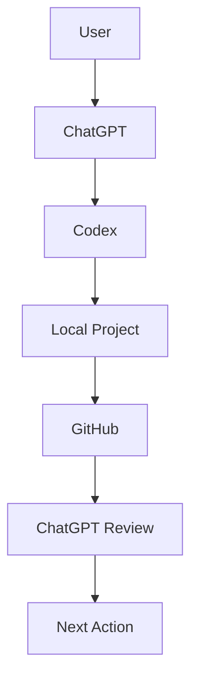

# AI Developer Assistant Collaboration Workflow

## Role Separation

### User

Responsibilities:
- Define goals
- Review decisions
- Ask research questions

### ChatGPT

Responsibilities:
- Research assistant
- Architecture reviewer
- Requirement analyst
- Generate Codex prompts
- Review GitHub progress

### Codex

Responsibilities:
- Local development agent
- Execute tasks
- Analyze repositories
- Create files
- Implement software
- Run tests

### GitHub

Responsibilities:
- Source of truth
- Store:
  - source code
  - documentation
  - diagrams
  - decisions
  - experiment results

## Full Workflow Diagram

